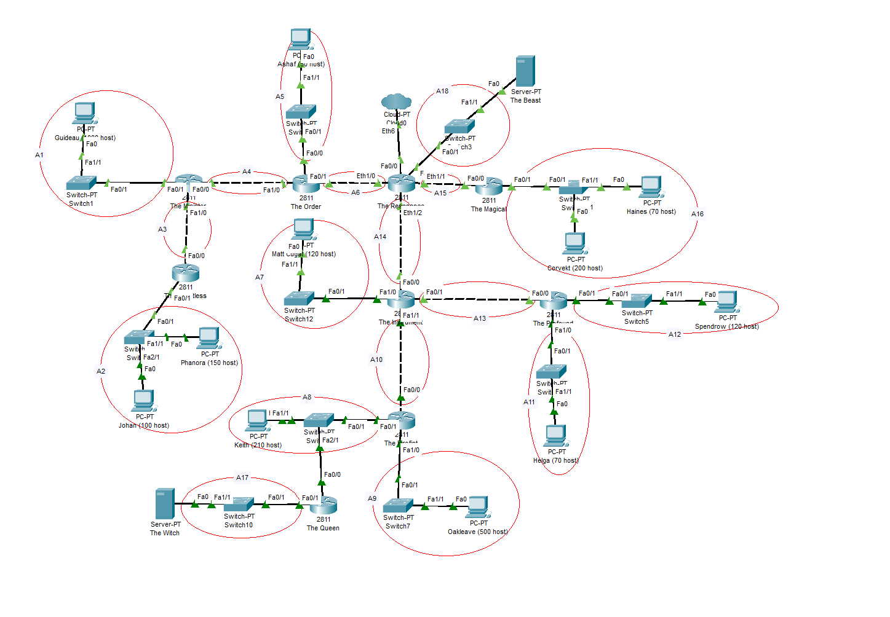
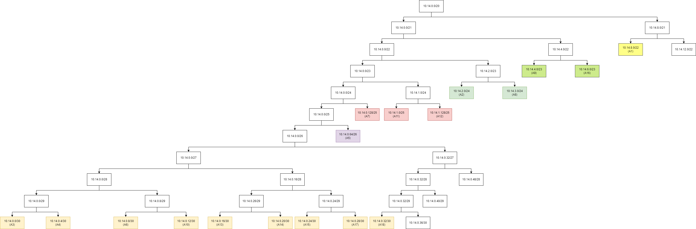
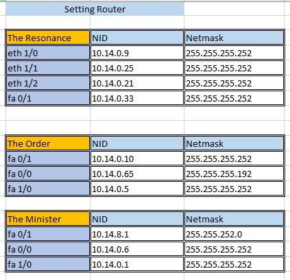
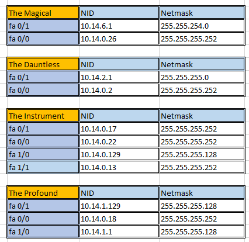
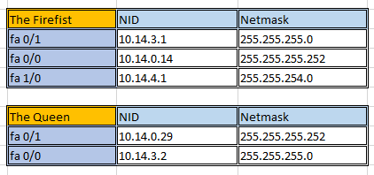
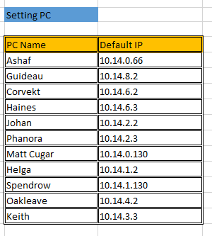

  

<h1 align="center">Laporan Praktikum 4 Kelompok C09 Jarkom C</h1>

---

Anggota Kelompok:

    <ul>
      <li>5025201089 [Andi Muhammad Rafli]</li>
      <li>5025201175 [Adinda Zahra Pamuji]</li>
      <li>5025201245 [Achmad Ferdiansyah]</li>
    </ul>

 

## Metode Perhitungan

- [VLSM](#VLSM)
- [CIDR](#getting_started)

## Membuat Topologi dan Pemetaan Jalur

   

## Metode VLSM 

- ### Menentukan Netmask dari Banyak Host yang Diperlukan.

<table style="border:2px solid">
  <tr>
    <th>Subnet</th>
    <th>Jumlah IP</th>
    <th>Netmask</th>
  </tr>
  <tr>
    <td>A1</td>
    <td>1001</td>
    <td>/22</td>
  </tr>
  <tr>
    <td>A2</td>
    <td>251</td>
    <td>/24</td>
  </tr>
  <tr>
    <td>A3</td>
    <td>2</td>
    <td>/30</td>
  </tr>
  <tr>
    <td>A4</td>
    <td>2</td>
    <td>/30</td>
  </tr>
  <tr>
    <td>A5</td>
    <td>51</td>
    <td>/26</td>
  </tr>
  <tr>
    <td>A6</td>
    <td>2</td>
    <td>/30</td>
  </tr>
  <tr>
    <td>A7</td>
    <td>121</td>
    <td>/25</td>
  </tr>
  <tr>
    <td>A8</td>
    <td>211</td>
    <td>/24</td>
  </tr>
  <tr>
    <td>A9</td>
    <td>501</td>
    <td>/23</td>
  </tr>
  <tr>
    <td>A10</td>
    <td>2</td>
    <td>/30</td>
  </tr>
  <tr>
    <td>A11</td>
    <td>71</td>
    <td>/25</td>
  </tr>
  <tr>
    <td>A12</td>
    <td>121</td>
    <td>/25</td>
  </tr>
  <tr>
    <td>A13</td>
    <td>2</td>
    <td>/30</td>
  </tr>
  <tr>
    <td>A14</td>
    <td>2</td>
    <td>/30</td>
  </tr>
  <tr>
    <td>A15</td>
    <td>2</td>
    <td>/30</td>
  </tr>
  <tr>
    <td>A16</td>
    <td>271</td>
    <td>/23</td>
  </tr>
  <tr>
    <td>A17</td>
    <td>2</td>
    <td>/30</td>
  </tr>
  <tr>
    <td>A18</td>
    <td>2</td>
    <td>/30</td>
  </tr>
  <tr style="background-color:grey">
    <td>TOTAL</td>
    <td>2617</td>
    <td>/20</td>
  </tr>
</table>
 

- ### Pembagian Alamat IP dan Routing

Mmebuat Tree dengan root netmask di /20 dengan membuat tree ke kiri bawah lalu lanjut ke kanan.

 

Dengan tree tersebut, didapatkan hasil pembagian IP sebagai berikut:

<table style="border:2px solid">
  <tr>
    <th rowspan="4" style="background-color:grey">A1</th>
  </tr>
  <tr>
    <td>Network ID</td>
    <td>10.14.8.0</td>
  </tr>
  <tr>
    <td>Netmask</td>
    <td>255.255.252.0</td>
  </tr>
  <tr>
    <td>Broadcast Address</td>
    <td>10.14.11.255</td>
  </tr>
  <tr>
    <th rowspan="4" style="background-color:grey">A2</th>
  </tr>
  <tr>
    <td>Network ID</td>
    <td>10.14.2.0</td>
  </tr>
  <tr>
    <td>Netmask</td>
    <td>255.255.255.0</td>
  </tr>
  <tr>
    <td>Broadcast Address</td>
    <td>10.14.2.255</td>
  </tr>
  <tr>
    <th rowspan="4" style="background-color:grey">A3</th>
  </tr>
  <tr>
    <td>Network ID</td>
    <td>10.14.0.0</td>
  </tr>
  <tr>
    <td>Netmask</td>
    <td>255.255.255.252</td>
  </tr>
  <tr>
    <td>Broadcast Address</td>
    <td>10.14.0.3</td>
  </tr>
  <tr>
    <th rowspan="4" style="background-color:grey">A4</th>
  </tr>
  <tr>
    <td>Network ID</td>
    <td>10.14.0.4</td>
  </tr>
  <tr>
    <td>Netmask</td>
    <td>255.255.255.252</td>
  </tr>
  <tr>
    <td>Broadcast Address</td>
    <td>10.14.0.7</td>
  </tr>
  <tr>
    <th rowspan="4" style="background-color:grey">A5</th>
  </tr>
  <tr>
    <td>Network ID</td>
    <td>10.14.0.64</td>
  </tr>
  <tr>
    <td>Netmask</td>
    <td>255.255.255.192</td>
  </tr>
  <tr>
    <td>Broadcast Address</td>
    <td>10.14.0.127</td>
  </tr>
  <tr>
    <th rowspan="4" style="background-color:grey">A6</th>
  </tr>
  <tr>
    <td>Network ID</td>
    <td>10.14.0.8</td>
  </tr>
  <tr>
    <td>Netmask</td>
    <td>255.255.255.252</td>
  </tr>
  <tr>
    <td>Broadcast Address</td>
    <td>10.14.0.11</td>
  </tr>
  <tr>
    <th rowspan="4" style="background-color:grey">A7</th>
  </tr>
  <tr>
    <td>Network ID</td>
    <td>10.14.0.128</td>
  </tr>
  <tr>
    <td>Netmask</td>
    <td>255.255.255.128</td>
  </tr>
  <tr>
    <td>Broadcast Address</td>
    <td>10.14.0.255</td>
  </tr>
  <tr>
    <th rowspan="4" style="background-color:grey">A8</th>
  </tr>
  <tr>
    <td>Network ID</td>
    <td>10.14.3.0</td>
  </tr>
  <tr>
    <td>Netmask</td>
    <td>255.255.255.0</td>
  </tr>
  <tr>
    <td>Broadcast Address</td>
    <td>10.14.3.255</td>
  </tr>
  <tr>
    <th rowspan="4" style="background-color:grey">A9</th>
  </tr>
  <tr>
    <td>Network ID</td>
    <td>10.14.4.0</td>
  </tr>
  <tr>
    <td>Netmask</td>
    <td>255.255.254.0</td>
  </tr>
  <tr>
    <td>Broadcast Address</td>
    <td>10.14.5.255</td>
  </tr>
  <tr>
    <th rowspan="4" style="background-color:grey">A10</th>
  </tr>
  <tr>
    <td>Network ID</td>
    <td>10.14.0.12</td>
  </tr>
  <tr>
    <td>Netmask</td>
    <td>255.255.255.252</td>
  </tr>
  <tr>
    <td>Broadcast Address</td>
    <td>10.14.0.15</td>
  </tr>
  <tr>
    <th rowspan="4" style="background-color:grey">A11</th>
  </tr>
  <tr>
    <td>Network ID</td>
    <td>10.14.1.0</td>
  </tr>
  <tr>
    <td>Netmask</td>
    <td>255.255.255.128</td>
  </tr>
  <tr>
    <td>Broadcast Address</td>
    <td>10.14.1.127</td>
  </tr>
  <tr>
    <th rowspan="4" style="background-color:grey">A12</th>
  </tr>
  <tr>
    <td>Network ID</td>
    <td>10.14.1.128</td>
  </tr>
  <tr>
    <td>Netmask</td>
    <td>255.255.255.128</td>
  </tr>
  <tr>
    <td>Broadcast Address</td>
    <td>10.14.1.255</td>
  </tr>
  <tr>
    <th rowspan="4" style="background-color:grey">A13</th>
  </tr>
  <tr>
    <td>Network ID</td>
    <td>10.14.0.16</td>
  </tr>
  <tr>
    <td>Netmask</td>
    <td>255.255.255.252</td>
  </tr>
  <tr>
    <td>Broadcast Address</td>
    <td>10.14.0.19</td>
  </tr>
  <tr>
    <th rowspan="4" style="background-color:grey">A14</th>
  </tr>
  <tr>
    <td>Network ID</td>
    <td>10.14.0.20</td>
  </tr>
  <tr>
    <td>Netmask</td>
    <td>255.255.255.252</td>
  </tr>
  <tr>
    <td>Broadcast Address</td>
    <td>10.14.0.23</td>
  </tr>
  <tr>
    <th rowspan="4" style="background-color:grey">A15</th>
  </tr>
  <tr>
    <td>Network ID</td>
    <td>10.14.0.24</td>
  </tr>
  <tr>
    <td>Netmask</td>
    <td>255.255.255.252</td>
  </tr>
  <tr>
    <td>Broadcast Address</td>
    <td>10.14.0.27</td>
  </tr>
  <tr>
    <th rowspan="4" style="background-color:grey">A16</th>
  </tr>
  <tr>
    <td>Network ID</td>
    <td>10.14.6.0</td>
  </tr>
  <tr>
    <td>Netmask</td>
    <td>255.255.254.0</td>
  </tr>
  <tr>
    <td>Broadcast Address</td>
    <td>10.14.7.255</td>
  </tr>
  <tr>
    <th rowspan="4" style="background-color:grey">A17</th>
  </tr>
  <tr>
    <td>Network ID</td>
    <td>10.14.0.28</td>
  </tr>
  <tr>
    <td>Netmask</td>
    <td>255.255.255.252</td>
  </tr>
  <tr>
    <td>Broadcast Address</td>
    <td>10.14.0.31</td>
  </tr>
  <tr>
    <th rowspan="4" style="background-color:grey">A18</th>
  </tr>
  <tr>
    <td>Network ID</td>
    <td>10.14.0.32</td>
  </tr>
  <tr>
    <td>Netmask</td>
    <td>255.255.255.252</td>
  </tr>
  <tr>
    <td>Broadcast Address</td>
    <td>10.14.0.35</td>
  </tr>
</table>

- ### Setting IP Router

 

- ### Setting IP PC

## CIDR 

These instructions will get you a copy of the project up and
